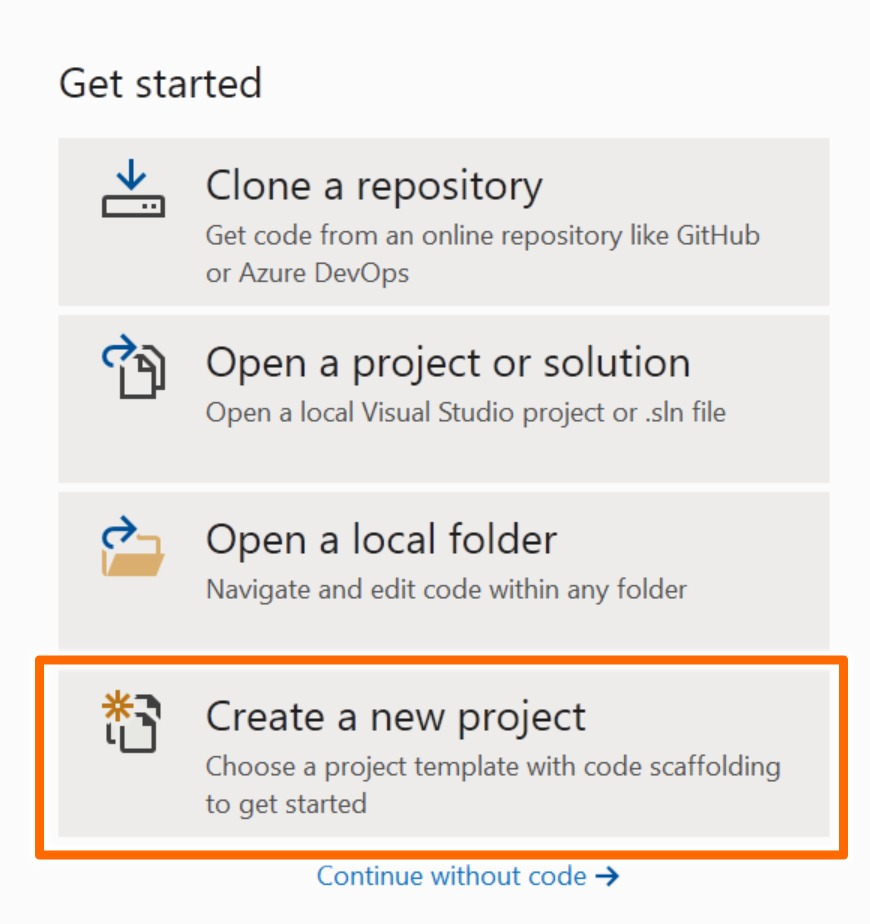
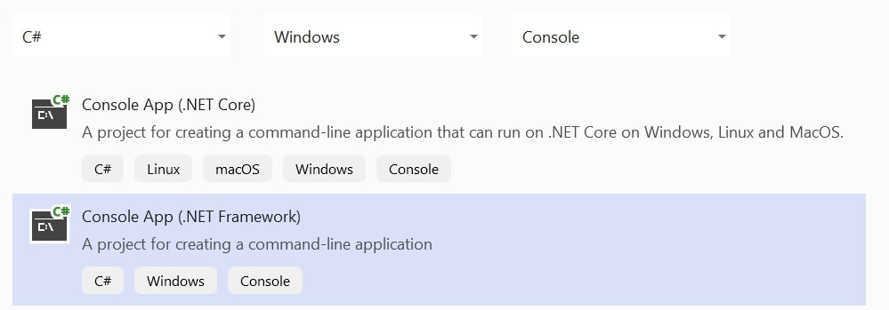
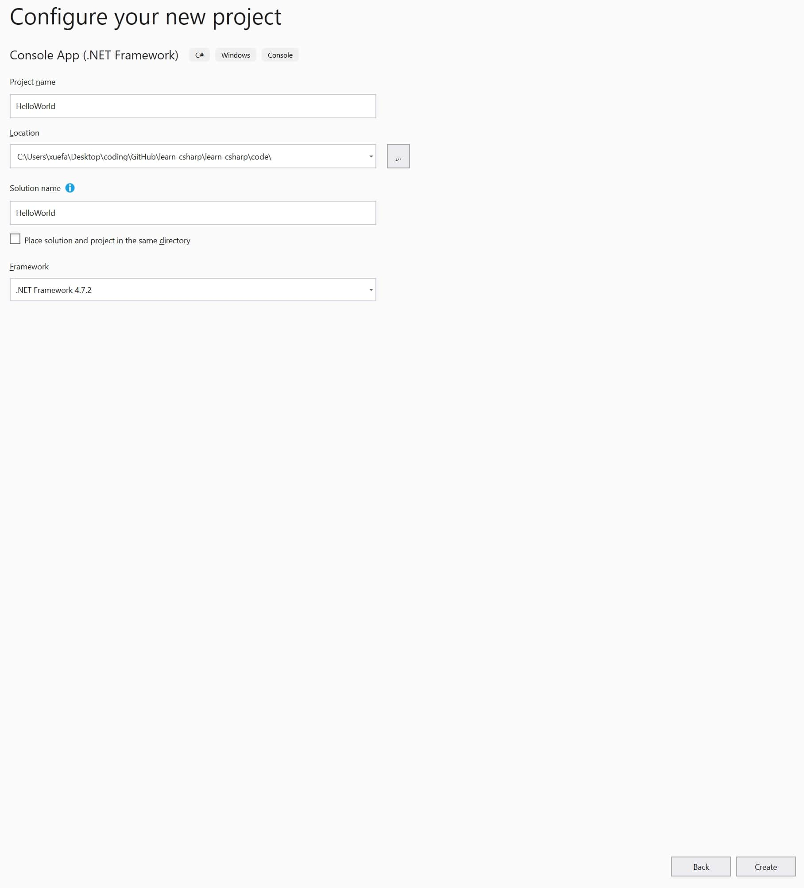
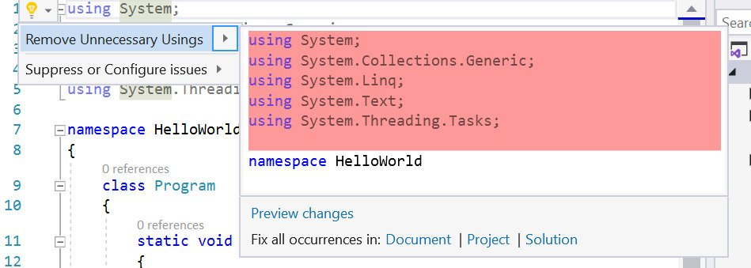

# Hello World

Create a new project



Use "Console App (.NET Framework)"



In the Project name field, type HelloWorld. Create a folder for the tutorial, and use that for the location.



Click Create.

Put your cursor onto line one and press Alt-Enter then Enter. You will do these steps for every lesson. I will give you the names.



Add 2 lines at the beginning. At line 1 type:

```csharp
using System;
```

At line 8 press enter and type:

```csharp
Console.WriteLine("Hello world!");
```

Delete `string[] args`

Now we can run it! In the top, go to Tools \| Options. Then go to Debugging \| Automatically close the console when debugging stops. Make sure that's unchecked. If you see `Hello world!`, your code works!

[Next][1]

[1]: understand-hello-world
